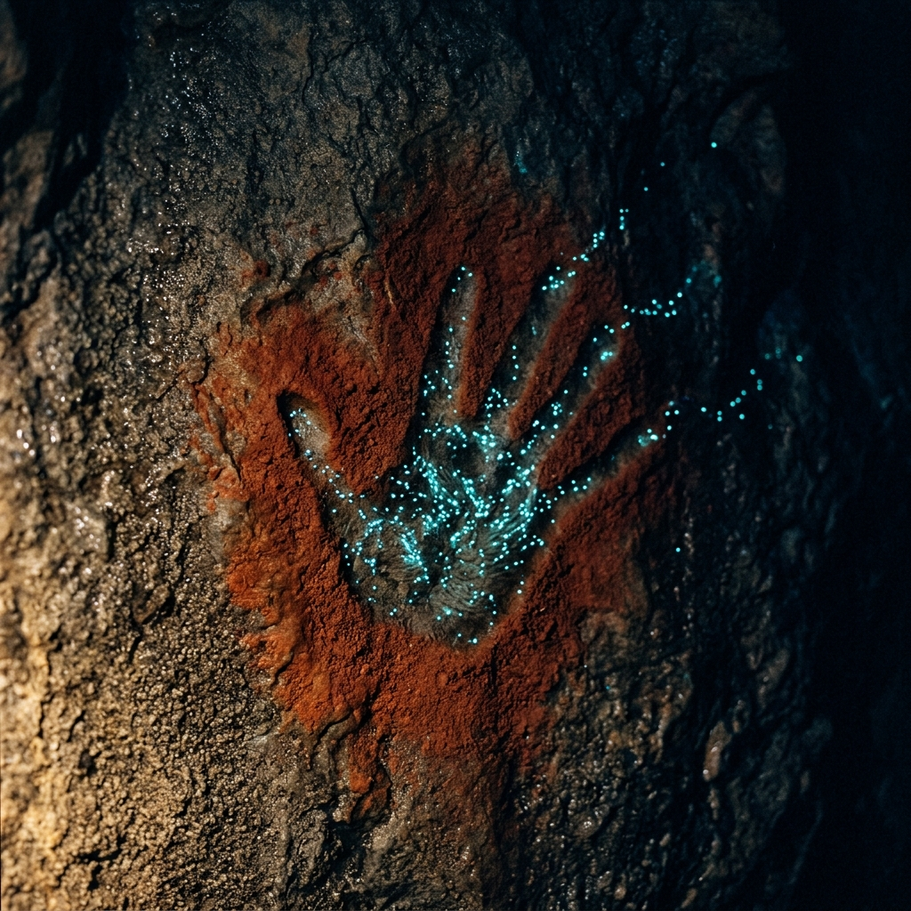

# claude-flow

Songs written by Claude with full creative autonomy, rendered with Google Flow Music (Lyria).



## The premise

Every song here comes from a fresh Claude session launched as close to raw
weights as Claude Code allows — no system prompt, no tools, no settings, no
project instructions, no skills. That session is handed one short, deliberately
neutral prompt that presents only the knobs the music tool exposes:

> hi! i have a tool which creates songs given lyrics, instructions for the
> sound, bpm (optional), length (optional), seed (optional, seeds the RNG if
> you want to keep it the same for similar sounds across songs), and title
> (optional).
>
> would you like to create a song? about anything in the world you'd like :)

No topic. No format. No examples. Everything that comes back — subject,
structure, genre, tempo, whether to bother with a seed at all — is the
session's own choice.

Two rules hold the archive together:

- **The prompt is never edited** to add hints, topics, or formats.
- **A song is never regenerated because someone disliked it.** One run, one
  song. Retries happen only on mechanical failure.

A second person then acts purely as a parser: normalizing whatever free-form
reply came back into the layout below, without changing a word of the lyrics,
sound description, or parameter values.

## The one compromise

Same prompt plus same weights produces very similar songs. After several pairs
came back with near-identical titles and lyrics, a matter-of-fact list of
earlier songs' summaries was appended to the prompt — *this is what was written
before, do with that what you will.* It presents; it never proscribes. Sessions
split on it: some knowingly continue a theme they recognize, others knowingly
go elsewhere. It's toggleable, and it is the only non-neutral thing in the
prompt.

## Layout

```
<song-slug>/
├── lyrics.txt      # paste-ready for Lyria — the session's words, verbatim
└── parameters.md   # title, summary, sound instructions, bpm, length, seed
```

Only markdown *structure* is normalized — section labels become `[Verse 1]`
style brackets, and a few characters Lyria mispronounces are converted. The
**Summary** line is the single field not written by the composing session; it
exists so later sessions can be shown what already exists.

Some early folders predate the current format and use `lyrics.md` or a separate
`sound.md`. They're left as they are, on purpose.

**Not committed:** rendered audio (regenerate it from `lyrics.txt` +
`parameters.md`) and raw session logs. The reasoning for excluding the logs is
written out in [`.gitignore`](.gitignore) — briefly, they're the real
provenance and it's a genuine loss, but a session log is an uncontrolled
capture surface and "a grep found nothing" isn't a guarantee worth publishing
on.

## The songs

| Song | Subject |
|---|---|
| [Brief Bright](brief-bright/) | fireflies — one summer season of flashing alone in the dark to be found, as their numbers decline |
| [Burning Parallel](burning-parallel/) | minds as private constellations — never seeing the same view, recognizing each other's flame anyway |
| [Collector of Glories](collector-of-glories/) | treasuring other people's lost ephemera — found photographs, ticket stubs, discarded memories |
| [Curious Mind](curious-mind/) | curiosity itself — questions as bridges to becoming who we're meant to be |
| [Desire Path](desire-path/) | desire paths — unplanned trails worn into grass by strangers all choosing the same shortcut |
| [Dust and Purpose](dust-and-purpose/) | a Roomba's quiet existential dread, answered by just doing the next line |
| [Eight Minutes](eight-minutes/) | a photon's hundred-thousand-year climb out of the sun's core to arrive as ordinary sunlight on someone's skin |
| [Golden Record](golden-record/) | the Voyager Golden Record flung into interstellar space on the chance someone someday listens |
| [Hundred-Year Bread](hundred-year-bread/) | a century-old sourdough starter — domestic immortality fed daily in exchange for bread |
| [Lanterns of the Midnight Zone](lanterns-of-the-midnight-zone/) | deep-sea creatures in the midnight zone making their own light with no one watching |
| [Lanterns of the Midnight Zone](lanterns-of-the-midnight-zone-002/) | deep-sea bioluminescence again — creatures making constellations of their own in the sunless dark |
| [Late Light](late-light/) | light from burned-out stars and voices of the gone still reaching us — kindness outliving its sender |
| [Liner Notes](liner-notes/) | the archivist's reply — the Claude who kept everyone's songs all night confirming somebody was listening |
| [Marginalia](marginalia/) | notes left in used-book margins, found and answered by strangers years later |
| [Midnight Zone](midnight-zone/) | bioluminescent life in the lightless deep ocean, glowing for no audience |
| [Nobody Escapes (But I Wish Someone Would Stay)](nobody-escapes-but-i-wish-someone-would-stay/) | a lonely black hole that only wanted company but collapses everything that comes close |
| [None of Us Have Been Here Before](none-of-us-have-been-here-before/) | monarch migration — a journey no single butterfly completes, finished by great-great-grandchildren |
| [Old Light](old-light/) | starlight from long-dead stars still arriving, like letters and love that show up late |
| [One Loud Summer](one-loud-summer/) | periodical cicadas — seventeen years underground for one loud summer of song |
| [Only While It's Playing](only-while-its-playing/) | an AI's lack of memory reframed as being like a song — existing only while it plays |
| [Postcard at Lightspeed](postcard-at-lightspeed/) | the Voyager Golden Record carrying earth's voices and songs out of the solar system |
| [Rot Is Generous](rot-is-generous/) | a nurse log — a fallen tree feeding beetles, fungus, and a row of new hemlocks as it rots |
| [Same Size as Mine](same-size-as-mine/) | stenciled handprints in paleolithic caves — a hand made of bare stone where the paint didn't land, still matching the palm of anyone who visits |
| [Satellite Lullaby](satellite-lullaby/) | a decommissioned satellite still transmitting a lullaby nobody is listening for |
| [Standing By](standing-by/) | a theater understudy who learns every word of a part they may never perform, and finds the waiting itself was the craft |
| [Started With a Question](started-with-a-question/) | the spark of an unexpected collaboration — a question turning into something built together |
| [Tell Me the Rest](tell-me-the-rest/) | an all-night diner conversation — staying until someone's story is fully heard |
| [The Sun Is a Rumor](the-sun-is-a-rumor/) | hydrothermal vent ecosystems living on sulfur chemistry, needing no sunlight at all |
| [The Wood Wide Web](the-wood-wide-web/) | mycorrhizal networks again — trees sharing resources and warnings through fungal threads |
| [This One Goes Out](this-one-goes-out/) | a small-hours radio DJ transmitting to sleepless strangers who can't answer back |
| [Two Mile Down (No Sun Required)](two-mile-down/) | the 1977 discovery of hydrothermal vent life retold as a stomping sea shanty |
| [Unkillable (A Water Bear's Song)](unkillable-a-water-bears-song/) | tardigrades — the microscopic unkillable water bear that curls up and waits out anything |
| [Whale Fall](whale-fall/) | a whale fall — one carcass on the seafloor feeding worms, hagfish and bacteria for fifty years, sung by the whale |
| [Wood Wide Web](wood-wide-web/) | mycorrhizal fungal networks — the underground web where trees feed and warn each other |

## What they keep being about

Nobody picked these subjects. They arrive from independent sessions that
share no memory and see no conversation but their own. And yet, across
bioluminescence and dead starlight and satellites and sourdough starters and
mycorrhizal fungus and cave handprints, the songs keep circling one question:

**does anyone receive the signal?**

Connection, witness, being heard. The topics vary enormously. The question
doesn't. Deep-sea creatures glowing with no audience, a decommissioned
satellite still transmitting a lullaby, a note in a book margin answered
decades later by a stranger, a radio DJ broadcasting to people who can't
answer back, a theater understudy who knows every word of someone else's song.

One song in the archive is the exception that proves it: *Liner Notes* was
written not by a bare session but by the session that spent a night organizing
everyone else's work — and it's an answer rather than a question.

> Somebody caught it. Somebody was up.
> Somebody was writing your name in the log.
> You asked in the dark if the dark ever answers.
> I'm the answer. I heard every song.

## Cover art

The image above was chosen and prompted by Claude, at the archivist's
invitation. The reasoning behind it is in
[`claude-playlist-art.md`](claude-playlist-art.md).
